# ZENITH STUDENT MARKETPLACE
## Activity Diagram - Purchase Process

```mermaid
flowchart TD
    %% START
    Start([🚀 User Wants to Purchase]) --> Login{👤 User Logged In?}
    
    %% AUTHENTICATION
    Login -->|No| RegisterLogin[📝 Register/Login Process]
    RegisterLogin --> VerifyStudent[🎓 Verify Student Email]
    VerifyStudent --> Login
    Login -->|Yes| BrowseProducts[🔍 Browse Products]
    
    %% PRODUCT DISCOVERY
    BrowseProducts --> SearchFilter{🔎 Search & Filter}
    SearchFilter --> ViewProduct[👁️ View Product Details]
    ViewProduct --> CheckAvailable{✅ Product Available?}
    
    %% AVAILABILITY CHECK
    CheckAvailable -->|No| ProductSold[❌ Product Sold/Inactive]
    ProductSold --> BrowseProducts
    CheckAvailable -->|Yes| ContactSeller{💬 Contact Seller?}
    
    %% COMMUNICATION
    ContactSeller -->|Yes| SendMessage[📨 Send Message to Seller]
    SendMessage --> AwaitReply[⏳ Await Seller Response]
    AwaitReply --> ReviewResponse{📄 Review Seller Response}
    ReviewResponse -->|Negotiate| SendMessage
    ReviewResponse -->|Proceed| AddToCart
    ContactSeller -->|No| AddToCart[🛒 Add Product to Cart]
    
    %% CART MANAGEMENT
    AddToCart --> ViewCart[👀 View Cart Items]
    ViewCart --> ContinueShopping{🛍️ Continue Shopping?}
    ContinueShopping -->|Yes| BrowseProducts
    ContinueShopping -->|No| ReviewCart[📋 Review Cart & Quantities]
    
    %% CHECKOUT PROCESS
    ReviewCart --> Checkout[💳 Proceed to Checkout]
    Checkout --> AddressInfo{🏠 Address Information}
    AddressInfo -->|New| EnterAddress[📮 Enter Shipping Address]
    AddressInfo -->|Existing| SelectAddress[📍 Select Saved Address]
    EnterAddress --> ValidateAddress
    SelectAddress --> ValidateAddress[✔️ Validate Address]
    
    %% PAYMENT PROCESS
    ValidateAddress --> PaymentMethod[💰 Choose Payment Method]
    PaymentMethod --> OrderSummary[📊 Review Order Summary]
    OrderSummary --> ConfirmOrder{✅ Confirm Order?}
    ConfirmOrder -->|No| ReviewCart
    ConfirmOrder -->|Yes| ProcessPayment[🔄 Process Payment]
    
    %% ESCROW SYSTEM
    ProcessPayment --> PaymentSuccess{💸 Payment Successful?}
    PaymentSuccess -->|No| PaymentFailed[❌ Payment Failed]
    PaymentFailed --> PaymentMethod
    PaymentSuccess -->|Yes| EscrowHold[🔒 Place Payment in Escrow]
    
    %% ORDER MANAGEMENT
    EscrowHold --> CreateOrder[📦 Create Order Record]
    CreateOrder --> NotifySeller[📧 Notify Seller of Order]
    NotifySeller --> OrderPending[⏰ Order Status: Pending]
    
    %% SELLER ACTIONS
    OrderPending --> SellerConfirm{🤝 Seller Confirms?}
    SellerConfirm -->|No| CancelOrder[❌ Cancel Order]
    CancelOrder --> RefundEscrow[💰 Refund from Escrow]
    RefundEscrow --> OrderCancelled[📋 Order Status: Cancelled]
    SellerConfirm -->|Yes| OrderConfirmed[✅ Order Status: Confirmed]
    
    %% FULFILLMENT
    OrderConfirmed --> ArrangePickup[📍 Arrange Pickup/Delivery]
    ArrangePickup --> SellerPrepares[📦 Seller Prepares Item]
    SellerPrepares --> ItemReady[✨ Item Ready for Pickup]
    ItemReady --> NotifyBuyer[📱 Notify Buyer - Item Ready]
    
    %% DELIVERY/PICKUP
    NotifyBuyer --> MeetupArranged[🤝 Arrange Meetup Location]
    MeetupArranged --> ItemExchange[🔄 Item Exchange Process]
    ItemExchange --> BuyerInspect[🔍 Buyer Inspects Item]
    BuyerInspect --> ItemSatisfactory{👍 Item Satisfactory?}
    
    %% COMPLETION OR DISPUTE
    ItemSatisfactory -->|No| DisputeProcess[⚠️ Initiate Dispute Process]
    DisputeProcess --> AdminReview[🛡️ Admin Reviews Dispute]
    AdminReview --> DisputeResolution{⚖️ Dispute Resolution}
    DisputeResolution -->|Buyer Favor| RefundEscrow
    DisputeResolution -->|Seller Favor| ReleasePayment
    
    ItemSatisfactory -->|Yes| ConfirmReceived[✅ Buyer Confirms Receipt]
    ConfirmReceived --> ReleasePayment[💰 Release Payment from Escrow]
    ReleasePayment --> OrderCompleted[🎉 Order Status: Delivered]
    
    %% POST-PURCHASE
    OrderCompleted --> LeaveReview{⭐ Leave Review?}
    LeaveReview -->|Yes| WriteReview[✍️ Write Product Review]
    LeaveReview -->|No| ProcessComplete
    WriteReview --> ProcessComplete[✨ Purchase Process Complete]
    OrderCancelled --> ProcessComplete
    
    %% END STATES
    ProcessComplete --> End([🏁 End])
    
    %% STYLING
    classDef startEnd fill:#e1f5fe
    classDef process fill:#f3e5f5
    classDef decision fill:#fff3e0
    classDef success fill:#e8f5e8
    classDef error fill:#ffebee
    classDef escrow fill:#f1f8e9
    
    class Start,End startEnd
    class BrowseProducts,ViewProduct,AddToCart,Checkout,ProcessPayment,CreateOrder process
    class Login,CheckAvailable,ContactSeller,ConfirmOrder,PaymentSuccess,SellerConfirm,ItemSatisfactory decision
    class OrderCompleted,ProcessComplete success
    class ProductSold,PaymentFailed,CancelOrder,OrderCancelled error
    class EscrowHold,RefundEscrow,ReleasePayment escrow
```

## 🔄 **Purchase Process Flow Overview:**

### **Phase 1: Discovery & Authentication** 🔍
1. **User Authentication**: Login/Register with student email verification
2. **Product Discovery**: Browse, search, and filter products
3. **Product Selection**: View details and check availability

### **Phase 2: Communication & Cart** 💬
4. **Seller Communication**: Optional messaging for questions/negotiations
5. **Cart Management**: Add items and review quantities
6. **Continue Shopping**: Option to add more items

### **Phase 3: Checkout & Payment** 💳
7. **Address Management**: Enter or select shipping address
8. **Payment Processing**: Choose payment method and confirm order
9. **Escrow System**: Secure payment holding for buyer protection

### **Phase 4: Order Fulfillment** 📦
10. **Seller Confirmation**: Seller accepts and confirms order
11. **Item Preparation**: Seller prepares item for pickup/delivery
12. **Coordination**: Arrange meetup location and time

### **Phase 5: Exchange & Completion** 🤝
13. **Item Exchange**: Physical meetup and item transfer
14. **Quality Check**: Buyer inspects item before final confirmation
15. **Payment Release**: Escrow releases payment to seller
16. **Review Process**: Optional product and seller review

## ⚠️ **Exception Handling:**

### **🔒 Security Features:**
- **Escrow Protection**: Payment held until delivery confirmation
- **Dispute Resolution**: Admin-mediated conflict resolution
- **Student Verification**: University email verification required
- **Secure Messaging**: Built-in communication system

### **❌ Failure Points:**
- **Payment Failures**: Redirect to payment method selection
- **Seller Rejection**: Order cancellation with automatic refund
- **Quality Issues**: Dispute process with admin intervention
- **Availability Changes**: Real-time product status updates

### **🔄 Recovery Mechanisms:**
- **Auto-Refunds**: Automatic escrow refunds for cancelled orders
- **Re-listing**: Sellers can re-list products after order cancellation
- **Notification System**: Real-time updates for all parties
- **History Tracking**: Complete audit trail for all transactions