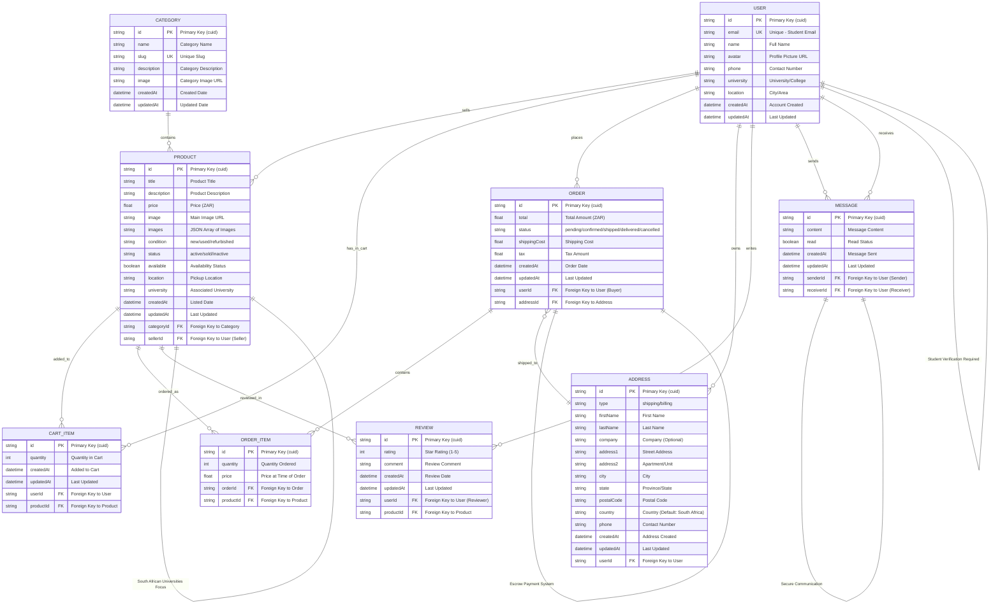

# ZENITH STUDENT MARKETPLACE
## Entity Relationship Diagram (ERD)

## Key Relationships & Business Rules:

### 🔗 **Primary Relationships:**
- **User (Seller) → Products**: One-to-Many (A user can sell multiple products)
- **User (Buyer) → Orders**: One-to-Many (A user can place multiple orders)
- **Category → Products**: One-to-Many (A category contains multiple products)
- **Order → OrderItems**: One-to-Many (An order contains multiple items)
- **Product → Reviews**: One-to-Many (A product can have multiple reviews)

### 🎓 **Business Rules:**
1. **Student Verification**: Users must verify with university email
2. **South African Focus**: Designed for SA universities and colleges
3. **Escrow System**: Secure payment holding until delivery confirmation
4. **Location-Based**: Products tagged with university/city for local pickup
5. **Multi-Category**: Textbooks, Electronics, Study Notes, Tutoring Services

### 📊 **Data Integrity:**
- **Unique Constraints**: User email, Category slug, User-Product cart combination, User-Product review combination
- **Default Values**: Order status (pending), Product status (active), Country (South Africa)
- **Cascading**: Related data maintained through foreign key relationships
- **Timestamps**: Automatic creation and update tracking on all entities